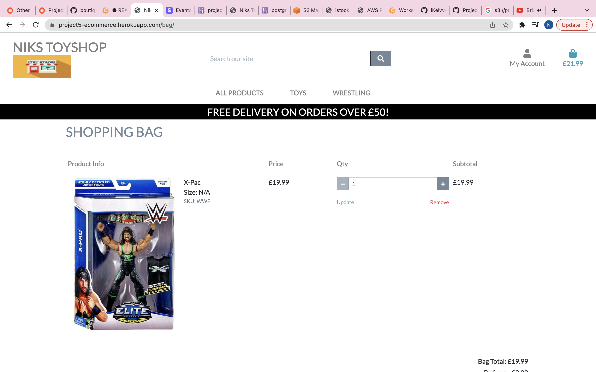
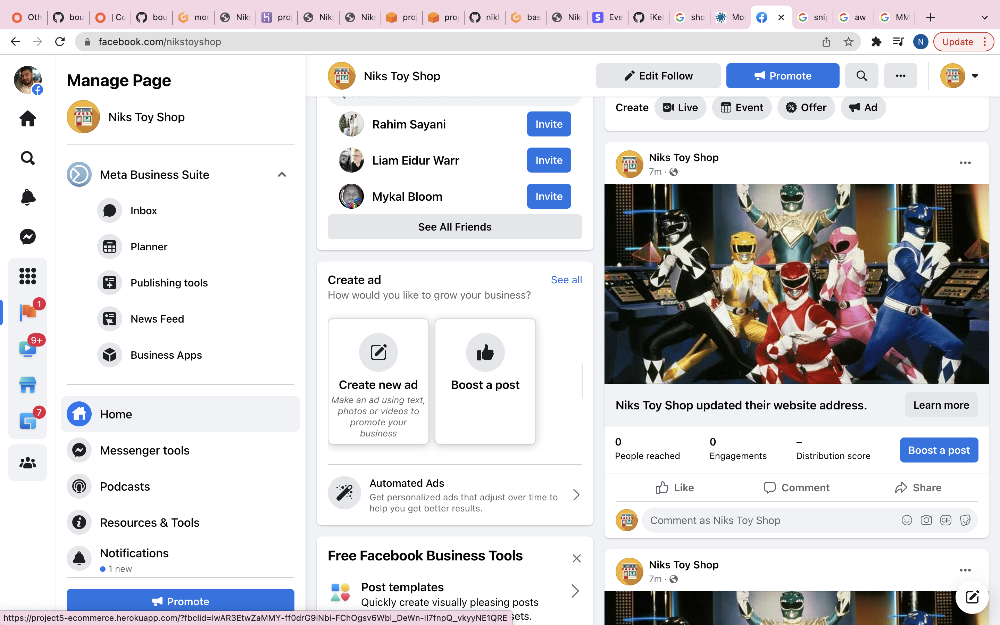

# Project 5 - E-commerce  

Welcome to my 5th project. This project is a functioning E-commerce Website.

I was trying to think of an idea that would make me proud for my last project. and it clicked.

When I was younger, I loved Toys! The majority of toys especially the older ones you see are the ones I actually had when I was younger. This is pure nostalgia for me.

My project will contain HTML, CSS, JavaScript, Python+Django, Relational databases & 
Stripe payments 

The admin of the website will also have the ability to use all CRUD functionality (Create, Read, Update, Delete).

[Here is a link to the final project](https://project5-ecommerce.herokuapp.com/)

# 1 - User Experience

## User Stories

The structure of the site is designed to be simple and easy to use. It has a good balance of images and content as not overload the user, while allowing the user to have all the information they require.

The website is for the following user types:

- Users who are interested in buying wrestling figures & nostalgic toys
- Users who are browsing to add to their collection or purchae for the first time
- Users who are browsing to purchase something as a gift.
- Users who are looking to make a bulk purchases if they require.

Client Goals

- The site needs to be easily accesible.
- The navigation menu needs to be simple to use on a range of devices, including desktop, tablet and mobile.
- Manoeuvering around the site should be simple and straightforward.
- To be able to create an user account.
- It should be easy to register, login and logout.
- The site should be informative and all the text should be easy to read.
- Checkout and pay for items easily whilst recieving confirmation 

First Time Visitors

- I want the site to be easy to understand
- I want the user how to navigate throughout the site easily.
- I want the user to be able to create an account easily.
- I want the content to be easily read and understandable.
- I want the checkout process to be straightforward and easy to understand.
- I want images to be clearly visible.
- I want to sort the list of available products so that I can easily identify the best rated, best priced and categorically sorted products.
- I want to sort a specific category of products so that I can find the best-priced or best-rated products in a specific category, or sort the products in that category by name.
- I want to easily add items to my basket so that I can view all the products I would like to purchase before completing payment.
- I want to easily remove items and update quantities from my basket so that I can remove any products I do not want before checking out.
- I want to easily enter my payment information at the checkout page so that I can checkout with no hassles.
- I want to feel safe and secure with my personal and payment information so that I can confidently provide the details to make a purchase.
- I want to be able to checkout as a guest.
- I want the first time visitor to sign up to our newsletter
- I want the first time visitor to reach out to us via a contact form

Returning User

- To be able to login.
- To be able to view previous orders.
- To be able to Create, Read, Update and Delete review comments
- To Recommend the site to friends and family.
- To make new purchases with saved details.

Admin User

- I want the admin to be able to create an account.
- I want the admin to be able to add a product.
- I want the admin to be able to edit a product.
- I want the admin to be able to delete a product.

Throughout the project I used the GitHub projects board to log all user stories as my project management tool. This helped me keep focus on the specific tasks as I would move them to the "in progress lane" as I'm working on the story. I would then move them to the "done" lane once the story has been completed. As you see below - you can see the story planned out with screenshots showing my progression.

# User Stories

Throughout the project, I used the GitHub projects board to log all user stories as my project management tool. This helped me keep the focus on the necessary tasks as I would move them to the "in progress lane" as I'm working on the story. I would then move them to the "done" lane once the story has been completed. I would add new user stories during the project to keep track of the tasks that had to be done.

# 2 Structure

It is really important to include responsive design in this project as many users are using different devices (mobile, tablet, laptop/PC). This gives the user the best experience on their device.

Responsive on all device sizes
Easy navigation through labelled buttons
Footer at the bottom of the each page that links to the social media websites, newsletter subscription form and business pages.
All elements will be consistent including font size, font family, colour scheme.

## Checkout Modals

## Products

## Profile

# Color Theme

Please find the colours schemes that I used below

# Wireframes

I used Balsamiq to create my wireframes as this gives the template of the UI. This also shows where all elements will be placed within the screen.

There are 2 versions of each wireframe as one shows the design on a web browser and on a Iphone

## Home

## login

## products

## my profile

## individual product

## add products ( superuser)

## checkout

## checkoutbag

## confirmation

## contact us

## Mobile

# 3 Features

All Pages
The navigation bar is placed at the top of all pages. This contains 2 sections that are separated. The first section is the product search bar, my account icon and the basket icon. The second section contains the main navigation for the products. The navigation bar is dynamic in that meaning depending on if the user is logged in or not the options will change.

If the user is not logged in the navigation bar will look like this:

If the user is logged in the navigation bar will look like this:

If the user is logged in as a superuser the navigation bar will look like this:

As a superuser, the admin will have access to the product management / adding deleting products.

The footer is placed at the bottom of each page with social media icons, a form to subscribe to the newsletter, a link to unsubscribe to the newsletter and useful business-related links. All links in the footer open the links in a new tab.

The business logo is also placed at the top of all pages. Clicking on it will also direct the user to the home page.

## Sign Up Page
A simple signup form that requires the user to enter a unique email address and a password. The password must be entered again for confirmation, this must match the already entered password above.

A message to prompt the user that if an account is already been created they can click the sign-in hyperlink to be redirected to the sign-in page.

If the user enters an email address that has already been registered, the user is prompted by an error message.

If the user enters a password that is not secure, the user will be prompted by a message.

If the user enters both passwords that do not match, the user is prompted by a message.

If the user does not enter an email address the form will show a validation error, prompting the user to enter the field in an email format.

## Login Page
A login form that requires the user to enter the email address and password that they used when signing up to the site.
The user can only log in once they have activated their account via an email received after signing up.

If the user enters in the wrong credentials, a message is displayed to the user.
Once the user has successfully logged in, they will be redirected to the home page. A success message will show to confirm the login has been successful.

## Landing Page

A shop now button that directs the user to the all products page. The user can then easily identify products they would like to purchase and add them to the basket.

## Products Page
The user can access the product pages by selecting the category on the navigation bar.

The page displays a count of the search results within the category.

Sort by the filter at the top right of the page, so the user can filter by price, rating, name and category.

Each product has an image, name of product, price, category and rating.

The page also contains a back to top button, which the user can click to go to the top of the page.

As a superuser, the admin can see the edit and delete buttons, allowing quick access to the product admin.

## Products Details Page
The product details will showcase an image, name of the product, short description, price,  category and rating, quantity selector, keep shopping button and an add to basket button.

When adding a product to the basket, the user will be prompted with a success message confirming the product has been added.

## Basket Page
This page shows each product as a line item, displaying an image, name of the product, weight, SKU, price per item, the quantity selected, quantity selector to update and a subtotal for each item.

A pricing summary of the whole basket is also shown with the basket total, delivery fee and total.

If the user has not met the free delivery threshold then an alert message is shown, prompting the user that they can qualify for free delivery if they spend more.

## Checkout Page
A checkout form, prompts the user to enter their delivery details with Stripe integration.

A checkbox for the user to confirm if they would like to save their details for next time. This only saves delivery details and not the card details.

A summary of the user's order is also shown, the user can then be sure they are making the correct purchase before continuing with the checkout process.

A message is shown just below the complete order button to warn the user that they will be charged a certain amount on their card.

## Checkout Success Page
This page shows a summary of their order, with an order number.

My Profile Page

This page shows a form so the user can update their delivery details. Upon completing the form, all delivery details will be updated if the user proceeds to the checkout page again.

Order history is also displayed, where the user can select the order number to view a previous order confirmation summary.
 An alert will also show prompting the user they are viewing a past order confirmation summary.

## Product Management Page
This page is for superusers only.

A form to add more products to the store.

## Newsletter Subscribe Page
A one-field form for the user to enter their email to subscribe to the newsletter.

Once the user has successfully subscribed to the newsletter, they will be redirected to the home page. A success message will show up confirming the user has successfully subscribed to the newsletter.

# Manual Testing

I have tested my site on Safari and google chrome on multiple devices.

These include:

iPhone X
iPhone XS Max
iPad Pro
MacBook Pro
Please find below my testing process for all pages via mobile and web:

## Navigation Bar

All Pages:

Home page	When clicking the "home" link in the navigation bar (mobile only) or on the business logo, the browser redirects me to the home page.	

All products page	When clicking the "All Products" link in the navigation bar, the category shows a dropdown list so I have access to more sort/filter options. The user will know they are on this page by the heading.

All Products - When clicking the "All Productss" link in the navigation bar, it will give you 4 options to click on : price,rating catogroy and all products.

Toys - When clicking the "toys" link in the navigation bar, you get to select 2 options which it will direct you to the page you selected

Wrestling -	When clicking the "Wrestling" link in the navigation bar, you get to select 2 options which it will direct you to the page you selected

Login / Logout page - When clicking the "login" or "logout links in the navigation bar, the browser redirects me to the login or logout page.

Basket page - When clicking the "basket" icon in the navigation bar, the browser redirects me to the basket page. The user will know they are on this page by the heading

My Profile page	- When clicking the "My profile" link in the navigation bar, the browser redirects me to my profile page. The user will know they are on this page by the heading.

Product management page - When clicking the "product management" link as a superuser in the navigation bar, the browser redirects me to the product management page. The user will know they are on this page by the heading.

Search bar- When searching for a keyword, the results will show products that contain the keyword in the product name or description.

Foreground & background colour - Checked foreground information is not distracted by background elements.	

Text - Checked that all fonts and colours used are consistent.

## Footer

Subscribe to newsletter	When filling out the newsletter form in the navigation bar from the footer, the browser redirects me to the home page if the form was completed successfully. The web page also shows me a success message.

Contact Us page	When clicking the "contact us" link in the footer, the browser redirects me to the contact page. The user will know they are on this page by the heading.

Register page	When clicking the "Register" link in the footer, the browser redirects me to the register page. The user will know they are on this page by the heading.

Login page	When clicking the "login" link in the footer, the browser redirects me to the login page.

Facebook - When clicking the Facebook icon, a new tab opens and redirects to the Facebook website.

Twitter	- When clicking the Twitter icon, a new tab opens and redirects to the Twitter website.

Instagram - When clicking the Instagram icon, a new tab opens and redirects to the Instagram website.

## Home page

Media - All media assets are displayed properly, have no pixelation or stretched images and are responsive on all devices.	
Responsiveness	Check every element on the page for consistent scalability in mobile, tablet and desktop view.

## Products page

Media - All media assets are displayed properly, have no pixelation or stretched images and are responsive on all devices.

Responsiveness - Check every element on the page for consistent scalability in mobile, tablet and desktop view.	

Sort filter	Check the sort/filter functionality by selecting each option. Each option reloads the page and sorts the products in the corresponding order.

Edit Button (SuperUser only)	Check the edit button is only accessible if the user is logged in as a SuperUser.

Delete Button (SuperUser only)	Check the delete button is only accessible if the user is logged in as a SuperUser.

## Products details page

Media - All media assets are displayed properly, have no pixelation or stretched images and are responsive on all devices.	
Responsiveness - Check every element on the page for consistent scalability in mobile, tablet and desktop view.	

Edit Button (SuperUser only) - Check the edit button is only accessible if the user is logged in as a SuperUser.

Delete Button (SuperUser only) - Check the delete button is only accessible if the user is logged in as a SuperUser.

## Shopping bag page

Media - All media assets are displayed properly, have no pixelation or stretched images and are responsive on all devices.	
Responsiveness - Check every element on the page for consistent scalability in mobile, tablet and desktop view.	

Remove item from bag - Clicking the remove link on an item removes the item from the bag.	

## Checkout page

Media - All media assets are displayed properly, have no pixelation or stretched images and are responsive on all devices.	
Responsiveness - Check every element on the page for consistent scalability in mobile, tablet and desktop view.

Checkout form - Filling in the form with the correct validation processes the order.	

Checkout form - Filling in the form with the incorrect validation shows errors messages.

Save details checkout - Selecting the "Save this delivery information to my profile" checkbox, this saves/updates my profile details.	

Card authentication	Used the Stripe test card details and purposely failed authenticated to check for error messages.

## Checkout success page

Responsiveness	Check every element on the page for consistent scalability in mobile, tablet and desktop view.	

Order history	When clicking on an order number in the order history section, this takes me to a past order confirmation summary page.	

Updating my profile	When updating the default delivery information, this reflects on the checkout page.

## Product management page                                  

Responsiveness - Check every element on the page for consistent scalability in mobile, tablet and desktop view.

Adding a product - When filling out the form to add a new product, the product is added to the relevant category and is searchable via the search bar.	

Uploading an image	When uploading an image to a new product, the site shows the name of the file that will be uploaded. When checking the product details page, the image also shows.

# 5 Technologies used

-   [HTML5](https://en.wikipedia.org/wiki/HTML)
    -   The project uses HyperText Markup Language.
-   [CSS3](https://en.wikipedia.org/wiki/CSS)
    -   The project uses Cascading Style Sheets.
-   [JavaScript](https://en.wikipedia.org/wiki/JavaScript)
    -   The project uses JavaScript.
-   [Python](https://en.wikipedia.org/wiki/Python_(programming_language))
    -   The project uses Python.
-   [Boostrap 5](https://getbootstrap.com/docs/5.0/getting-started/introduction/)
    -   The project uses Bootstrap 5.
-   [PostgreSQL](https://www.postgresql.org/)
    -   The project uses PostgreSQL as a database.
-   [Gitpod](https://www.gitpod.io/)
    -   The project uses Gitpod.
-   [Chrome](https://www.google.com/intl/en_uk/chrome/)
    -   The project uses Chrome to debug and test the source code using HTML5.
-   [Balsamiq](https://balsamiq.com/)
    -   Balsamiq was used to create the wireframes during the design process.
-   [GitHub](https://github.com/)
    -   GitHub was used to store the project's code after being pushed from Git.
-   [Stripe](https://stripe.com/gb)
    - Stripe was used to create a payment system
-   [Googlefont](https://fonts.google.com/)
    - was used for all the text content on the site pages.
-   [AmIResponsive](https://ui.dev/amiresponsive)
    - Am i Responsive was used to create the image in my Final Design section.
-   [AWS](https://aws.amazon.com/)
    - The project uses Amazon Web Services to host all static and media files.

# 6 Testing

## Validators

 - majority of my errors were part of the jinga template

 - no errors

![css1]!(media/css.png)

I used the python3 -m flake8 command within GitPod to check for any errors within my Python files. The validator showed multiple "line too long" errors. This was rectified by adding each statement as a new line.

There were also "line too long" errors within my settings.py file but I have chosen to ignore these as this is a very important file.

# Lighthouse

## home page

## shopping bag

## checkout bag

## my profile

## successpage

# Solved Bugs

some of the erros i solved are below

1. 

2. 

3. 

# 7 Development Cycle

I used GitHub pages to deploy my final project. To do this I had to:
1. Login or Sign Up to [GitHub] - https://github.com/nikhilkalhan92/Project-5---Ecommerce
2. Create a new repository named "Project-5---Ecommerce"
3. Once created, click on "Settings" on the navigation bar under the repository title.
4. Choose which folder to deploy from, I used "/root".
5. Click "Save", then wait for it to be deployed. 
6. The URL will be displayed above the "source" section in GitHub Pages.

## I used the terminal to deploy my project locally. To do this I had to:

- Create a repository on GitHub.
- Clone the repository on your chosen source code editor (GitPod in my case) using the clone link.
- Open the terminal within GitPod
- Enter "python3 manage.py runserver into the terminal.
- Go to localhost address on my web browser.
- All locally saved changes will show up here.

## For the final deployment to Heroku, I had to:

- Create Heroku App
- Install dj_database_url and psycopg2-binary in my local environment
- Freeze requirements.txt file
- In settings.py import dj_database_url
- Back up the local database using "./manage.py dumpdata --exclude auth.permission --exclude contenttypes > db.json" in  the terminal window.
- Comment out the local default database
- Add the Heroku database url via dj_database_url.parse()
- Run migrations to the Postgres database
- Restore the database using this command "./manage.py loaddata db.json" in the terminal windows.
- Create a SuperUser for the Postgres database
- Configure the database so that when the app is running on Heroku it uses the Postgres database and when it's running locally it uses the SQLite database
- Create Procfile so that Heroku creates a web dyno so that it will run gunicorn and serve the Django app
- Disable Heroku collect static
- Add the Heroku hostname to allowed hosts in settings.py
- Generate a new Django secret key and add this to the Heroku config variables
- Replace the secret key in settings.py to grab it from the environment
- Set debug to True only if the environment is a development environment
- Commit changes and deploy to GitHub and Heroku
- Create an AWS account
- Create an S3 bucket
- Configure the S3 bucket settings and policies
- Create and configure the IAM service
- In the terminal install Boto3 and Django-storages
- Freeze requirements.txt file
- Add a statement to the AWS bucket if the environment is "USE_AWS"
- Add AWS keys to the Heroku config variables
- Create custom storage classes for media and static files
- In settings.py add a statement to use the static and media storage class and locations
- Commit and push to GitHub and Heroku
- In the S3 bucket create a new folder for media
- Upload all used images to the media file in the S3 bucket
- Add the Stripe keys to the Heroku config variables
- Create a new webhook endpoint from the Stripe dashboard
- Add all the Stripe keys to the Heroku config variables

# 7. Marketing 

For my marketing strategies, I decided to go with content marketing, Social media and email marketing root

Social media - Using these platforms will help build and interact with customers to build relationships and loyalty. This also helps build the brand. Followers will help share the business posts and in result gain more traction with other people. The same content can be across all social media platforms.

Email marketing - Using email marking via a newsletter will be beneficial as it is a free source of marketing. Those who are subscribed are more likely to convert into paying customers. This will increase sales and returning customers as I can provide discount codes and other special offers. A good pro is that the business has total control over the design of the emails.

I made an online social media page for my store. You can see the screenshots below via browser and mobile.

Browser

# 8. SEO

To improve the search engine optimisation (SEO) of the site I:

Added keywords in a meta tag to my base.html. The keywords were researched using WordTracker, there are a number of short-tail and long-tail keywords.

The following words were added due to popularity for certain products & words affilated to them
- WWE 
- AEW 
- Tag Team Titles 
- Sports Entertainment
- Hot Wheels
- WCW
- Sting
- Wolfpac
- Mighty Morphin Power Rangers
- Green with Evil
- Pro-Wrestling
- DX
- Attitude Era

# 9 Final Product

# 10 Project Acknowledgements 

Marcel - my mentor who has been fantastic. Since the day I started he has helped

Friends & family who have supported me

Code Institute 

