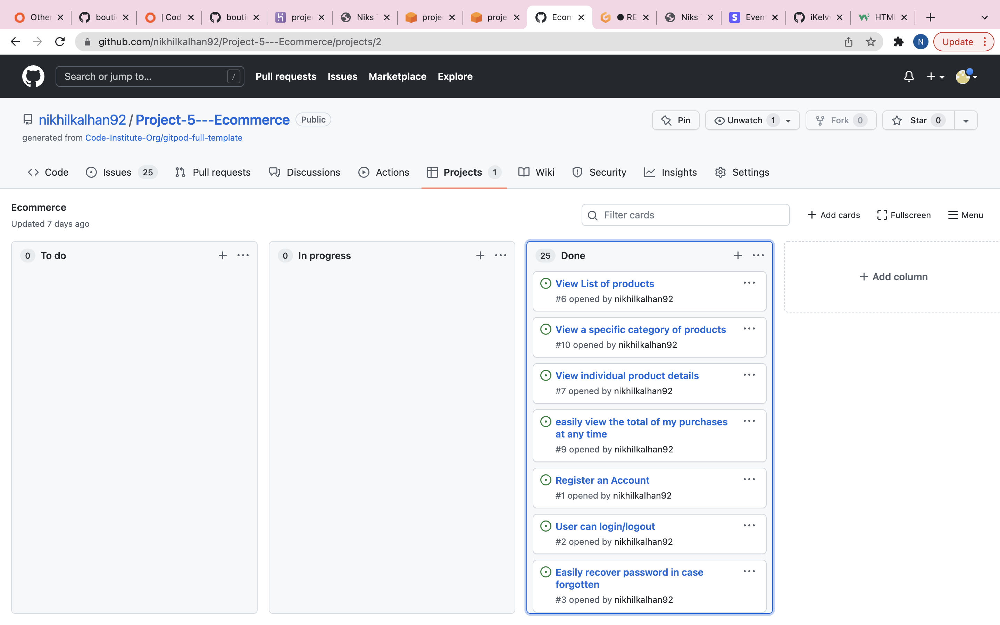
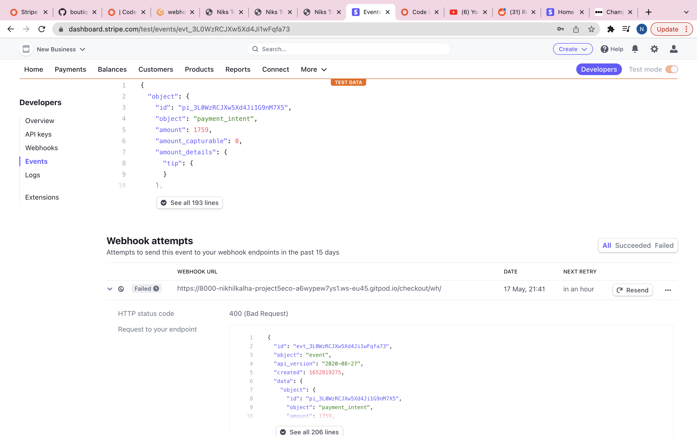

# Project 5 - E-commerce  

Welcome to my 5th project. This project is a functioning E-commerce Website.

I was trying to think of an idea that would make me proud for my last project. and it clicked.

When I was younger, I loved Toys! The majority of toys especially the older ones you see are the ones I actually had when I was younger. This is pure nostalgia for me.

My project will contain HTML, CSS, JavaScript, Python+Django, Relational databases & 
Stripe payments 

The admin of the website will also have the ability to use all CRUD functionality (Create, Read, Update, Delete).

Link to final Project is here -

# 1 - User Experience

## User Stories

The structure of the site is designed to be simple and easy to use. It has a good balance of images and content as not overload the user, while allowing the user to have all the information they require.

The website is for the following user types:

- Users who are interested in buying wrestling figures & nostalgic toys
- Users who are browsing to add to their collection or purchae for the first time
- Users who are browsing to purchase something as a gift.
- Users who are looking to make a bulk purchases if they require.

Client Goals

- The site needs to be easily accesible.
- The navigation menu needs to be simple to use on a range of devices, including desktop, tablet and mobile.
- Manoeuvering around the site should be simple and straightforward.
- To be able to create an user account.
- It should be easy to register, login and logout.
- The site should be informative and all the text should be easy to read.
- Checkout and pay for items easily whilst recieving confirmation 

First Time Visitors

- I want the site to be easy to understand
- I want the user how to navigate throughout the site easily.
- I want the user to be able to create an account easily.
- I want the content to be easily read and understandable.
- I want the checkout process to be straightforward and easy to understand.
- I want images to be clearly visible.
- As a first-time visitor, I want to sort the list of available products so that I can easily identify the best rated, best priced and categorically sorted products.
- As a first-time visitor, I want to sort a specific category of products so that I can find the best-priced or best-rated products in a specific category, or sort the products in that category by name.
- As a first-time visitor, I want to easily add items to my basket so that I can view all the products I would like to purchase before completing payment.
- As a first-time visitor, I want to easily remove items and update quantities from my basket so that I can remove any products I do not want before checking out.
- As a first-time visitor, I want to easily enter my payment information at the checkout page so that I can checkout with no hassles.
- As a first-time visitor, I want to feel safe and secure with my personal and payment information so that I can confidently provide the details to make a purchase.
- As a first-time visitor, I want to be able to checkout as a guest.
- I want the first time visitor to sign up to our newsletter
- I want the first time visitor to reach out to us via a contact form

Returning User

- To be able to login.
- To be able to view previous orders.
- To be able to Create, Read, Update and Delete review comments
- To Recommend the site to friends and family.
- To make new purchases with saved details.

Admin User

- I want the admin to be able to create an account.
- I want the admin to be able to add a product.
- I want the admin to be able to edit a product.
- I want the admin to be able to delete a product.

Throughout the project I used the GitHub projects board to log all user stories as my project management tool. This helped me keep focus on the specific tasks as I would move them to the "in progress lane" as I'm working on the story. I would then move them to the "done" lane once the story has been completed. As you see below - you can see the story planned out with screenshots showing my progression.

# User Stories

Throughout the project, I used the GitHub projects board to log all user stories as my project management tool. This helped me keep the focus on the necessary tasks as I would move them to the "in progress lane" as I'm working on the story. I would then move them to the "done" lane once the story has been completed. I would add new user stories during the project to keep track of the tasks that had to be done.

# 2 Structure

## Design 

## Fonts

## Color Theme

Please find the colours schemes that I used below

## Wireframes

# Features

All Pages
The navigation bar is placed at the top of all pages. This contains 2 sections that are separated. The first section is the product search bar, my account icon and the basket icon. The second section contains the main navigation for the products. The navigation bar is dynamic in that meaning depending on if the user is logged in or not the options will change.

If the user is not logged in the navigation bar will look like this:

If the user is logged in the navigation bar will look like this:

If the user is logged in as a superuser the navigation bar will look like this:

##

# 3 Skelton

I used Balsamiq to create my wireframes as this gives the template of the UI. This also shows where all elements will be placed within the screen.

There are 3 versions of each wireframe as one shows the design on a web browser and the other show on a Ipad and Iphone

# 4 Features

# 5 Technologies used

-   [HTML5](https://en.wikipedia.org/wiki/HTML)
    -   The project uses HyperText Markup Language.
-   [CSS3](https://en.wikipedia.org/wiki/CSS)
    -   The project uses Cascading Style Sheets.
-   [JavaScript](https://en.wikipedia.org/wiki/JavaScript)
    -   The project uses JavaScript.
-   [Python](https://en.wikipedia.org/wiki/Python_(programming_language))
    -   The project uses Python.
-   [Boostrap 5](https://getbootstrap.com/docs/5.0/getting-started/introduction/)
    -   The project uses Bootstrap 5.
-   [PostgreSQL](https://www.postgresql.org/)
    -   The project uses PostgreSQL as a database.
-   [Gitpod](https://www.gitpod.io/)
    -   The project uses Gitpod.
-   [Chrome](https://www.google.com/intl/en_uk/chrome/)
    -   The project uses Chrome to debug and test the source code using HTML5.
-   [Balsamiq](https://balsamiq.com/)
    -   Balsamiq was used to create the wireframes during the design process.
-   [GitHub](https://github.com/)
    -   GitHub was used to store the project's code after being pushed from Git.
-   [Stripe](https://stripe.com/gb)
    - Stripe was used to create a payment system
-   [Googlefont](https://fonts.google.com/)
    - was used for all the text content on the site pages.
-   [AmIResponsive](https://ui.dev/amiresponsive)
    - Am i Responsive was used to create the image in my Final Design section.
-   [AWS](https://aws.amazon.com/)
    - The project uses Amazon Web Services to host all static and media files.

# Solved Bugs

1. 

2. 

3. 

4. 

5. 

## Testing
Validators

## Full Testing

## Lighthouse

# 6. Development Cycle

I used GitHub pages to deploy my final project. To do this I had to:
1. Login or Sign Up to [GitHub] - https://github.com/nikhilkalhan92/Project-5---Ecommerce
2. Create a new repository named "Project-5---Ecommerce"
3. Once created, click on "Settings" on the navigation bar under the repository title.
4. Choose which folder to deploy from, I used "/root".
5. Click "Save", then wait for it to be deployed. 
6. The URL will be displayed above the "source" section in GitHub Pages.

## I used the terminal to deploy my project locally. To do this I had to:

- Create a repository on GitHub.
- Clone the repository on your chosen source code editor (GitPod in my case) using the clone link.
- Open the terminal within GitPod
- Enter "python3 manage.py runserver into the terminal.
- Go to localhost address on my web browser.
- All locally saved changes will show up here.

## For the final deployment to Heroku, I had to:

- Create Heroku App
- Install dj_database_url and psycopg2-binary in my local environment
- Freeze requirements.txt file
- In settings.py import dj_database_url
- Back up the local database using "./manage.py dumpdata --exclude auth.permission --exclude contenttypes > db.json" in  the terminal window.
- Comment out the local default database
- Add the Heroku database url via dj_database_url.parse()
- Run migrations to the Postgres database
- Restore the database using this command "./manage.py loaddata db.json" in the terminal windows.
- Create a SuperUser for the Postgres database
- Configure the database so that when the app is running on Heroku it uses the Postgres database and when it's running locally it uses the SQLite database
- Create Procfile so that Heroku creates a web dyno so that it will run gunicorn and serve the Django app
- Disable Heroku collect static
- Add the Heroku hostname to allowed hosts in settings.py
- Generate a new Django secret key and add this to the Heroku config variables
- Replace the secret key in settings.py to grab it from the environment
- Set debug to True only if the environment is a development environment
- Commit changes and deploy to GitHub and Heroku
- Create an AWS account
- Create an S3 bucket
- Configure the S3 bucket settings and policies
- Create and configure the IAM service
- In the terminal install Boto3 and Django-storages
- Freeze requirements.txt file
- Add a statement to the AWS bucket if the environment is "USE_AWS"
- Add AWS keys to the Heroku config variables
- Create custom storage classes for media and static files
- In settings.py add a statement to use the static and media storage class and locations
- Commit and push to GitHub and Heroku
- In the S3 bucket create a new folder for media
- Upload all used images to the media file in the S3 bucket
- Add the Stripe keys to the Heroku config variables
- Create a new webhook endpoint from the Stripe dashboard
- Add all the Stripe keys to the Heroku config variables

# 7. Marketing 

I made an online social media page for my store. You can see the screenshots below via browser and mobile.

Browser

